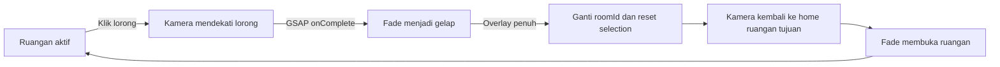

# Multi-room gallery / Galeri multi-ruangan

## Bahasa Indonesia

Klik bidang lorong kanan atau tombol **Explore the next room** untuk berpindah. Tombol yang sama di ruang kedua membawa kembali ke ruang pertama. Tombol Back tetap berarti keluar dari fokus objek dalam ruangan aktif.

Ruang I mempertahankan koleksi utama dan vending machine. Ruang II adalah contoh dengan dinding hijau lembut, pencahayaan berbeda, dan susunan ulang tiga lukisan yang sudah tersedia. Belum ada asset lukisan baru.

### Pembagian kode

- `galleryRooms.ts`: definisi ID, judul, tujuan pintu, warna, cahaya, ketersediaan vending, dan posisi fokus lorong.
- `RoomPortal.tsx`: hitbox transparan pada bukaan kanan, outline hover, dan tombol HTML yang dapat diakses dengan Tab/Enter.
- `GalleryCanvas.tsx`: pemilik `roomId` dan fase `idle`, `approaching`, `covering`, `revealing`. Ref pengunci mencegah klik ganda sebelum React sempat memperbarui state. `inert` menonaktifkan input pada viewport selama perpindahan.
- `CameraController.tsx`: memanggil `onArrive` setelah tween selesai; `useLayoutEffect` mengembalikan kamera ke home ketika ruangan berganti, saat overlay masih gelap.
- `GalleryScene.tsx`: memilih koleksi, tema ruangan, pintu tujuan, serta apakah vending machine ditampilkan. `key={roomId}` dari parent mereset state hover dan form lokal pada pergantian ruangan.
- `GalleryRoom.tsx`: menerima warna dinding dan lantai opsional, dengan geometri skylight yang dipakai bersama.
- `globals.css`: penanda ruangan, tombol lorong, status perpindahan, dan overlay fade. `isolation: isolate` pada viewport menjaga HTML dari Drei tetap di bawah overlay transisi.

Animasi pendekatan menggunakan durasi kamera existing 1,2 detik. Fade keluar dan masuk masing-masing 0,4 detik. Callback GSAP mengurutkan perpindahan; tidak ada timer perkiraan untuk mengganti ruangan. Cleanup menghentikan tween jika komponen dilepas.

### Menambah ruangan berikutnya

1. Tambahkan ID ke `GalleryRoomId` dan definisi ke `GALLERY_ROOMS`.
2. Atur `nextRoom` setiap pintu sehingga tidak menunjuk ke ID yang hilang.
3. Tambahkan pemilihan data lukisan di `GalleryScene.tsx`; saat ini koleksi kedua memakai ulang tiga texture dari ruang utama dengan posisi berbeda.
4. Untuk bentuk bangunan berbeda, perluas pemilihan komponen bangunan dan konfigurasi kamera home; saat ini kedua ruangan memakai geometri dan home yang sama.
5. Uji klik lorong, klik cepat berulang, kembali ke ruangan awal, fokus lukisan, serta reset form vending.

Implementasi ini mengganti scene di dalam satu Canvas. Kedua ruangan tidak dirender sebagai bangunan yang tersambung secara fisik; belum ada gerak bebas melintasi pintu atau collision. Reload memulai kembali di Ruang I.

Penjelasan lengkap dan langkah demi langkah telah terintegrasi ke panduan MD/PDF versi 1.2. Catatan ini dipertahankan sebagai ringkasan implementasi bilingual.

## English

Click the right-hand passage or its **Explore the next room** button to enter the second room. Its portal returns to the first room. Back still exits object focus within the current room.

Room I keeps the main collection and vending machine. Room II demonstrates a sage wall palette, different sunlight intensity, and a rearrangement of the existing three artwork textures.

`GalleryCanvas` owns the room ID and transition phases. Camera arrival starts the fade-out. Once the overlay is opaque, the room changes and selection/form state resets. `CameraController` resets the camera before the new room is revealed. An input lock and an inert viewport prevent overlapping navigation; the room key resets local component state.

The approach takes 1.2 seconds, followed by a 0.4-second fade-out and a 0.4-second fade-in. GSAP completion callbacks sequence these steps. The viewport creates a stacking context so Drei HTML overlays cannot appear above the transition cover.

To add another room, extend `GalleryRoomId`, `GALLERY_ROOMS`, and the artwork selection in `GalleryScene`. Each destination must refer to an existing room. Different building geometry or home camera positions require extending those configurations too.

This implementation swaps rooms within one Canvas; it does not yet create physically connected spaces with free movement or collision. Reload starts in Room I. The complete explanation is integrated into the v1.2 bilingual MD/PDF guides; this file remains a concise implementation summary.
